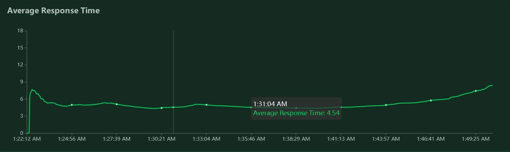

# car-pooling-service
<!--  -->
**Golang microservice for car pooling management**<br>
car-pooling-service is a microservice designed to manage car pooling scheduling.

[](https://goreportcard.com/report/github.com/pablomartinfranco/car-pooling-challenge)

<!-- [](https://gitlab-hiring.cabify.tech/cabify-challenge/car-pooling-challenge-candidate-jAwOTdhODk/-/blob/master/.gitlab-ci.yml) -->

<!-- [](https://gitlab-hiring.cabify.tech/cabify-challenge/car-pooling-challenge-candidate-jAwOTdhODk/-/blob/master/.gitlab-ci.yml) -->

<!-- [](https://gitlab-hiring.cabify.tech/cabify-challenge/car-pooling-challenge-candidate-jAwOTdhODk/-/blob/master/.gitlab-ci.yml) -->


## Setup and Prerequisites

Install dependencies:

- [`golang 1.18 >=`](https://golang.org/dl/)
- [`docker`](https://docs.docker.com/get-docker/)
- [`GNU make`](https://www.gnu.org/software/make/)

Application can run locally with the Makefile or from the Dockerfile

Please review `.env.conf` settings before running

### Makefile

Clean, build and run tests

```bash
make all
```

Run locally

```bash
make run
```

See `Makefile` for further commands.

Configuration settings at `.env.conf`

| Configuration             | Description                            |
| ------------------------- | -------------------------------------- |
| STAGE_STATUS              | Label for identifying stage            |
| SERVER_HOST               | Address where the server listens       |
| SERVER_PORT               | Port where the server listens          |
| SERVER_DEBUG              | Enable loggin debug info               |
| SERVER_REQUEST_TIMEOUT    | Server request timeout in seconds      |
| SERVER_SHUTDOWN_TIMEOUT   | Server grace timeout in seconds        |
| JOURNEY_WORKER_POOL       | Amount of journey scheduler workers    |
| DROPOFF_WORKER_POOL       | Amount of dropoff scheduler workers    |
| DROPOFF_RETRY_LIMIT       | Amount of dropoff retries when fail    |

### Docker

Build docker image and run deployed app from container

```bash
make dockerize
```

### Guides and References

- [Chanllenge requirements](README-challenge.md)

Web API Specification:

| URI                 | Description                                                     |
| ------------------- | --------------------------------------------------------------- |
| `GET  /status`      | Responds with status code 200 if the service is up and running. Indicates that the service has started correctly and is ready to accept requests. |
| `PUT  /cars`        | Registers a list of cars for carpooling scheduling and resets the application state. The method is used to load available cars into the service. The body of the request should contain a list of cars in JSON format. Returns a 200 OK when the list is registered correctly. Returns a 400 Bad Request when there is a failure in the request format, expected headers, or the payload can't be unmarshalled. This method may be called multiple times during the service's lifecycle to update the list of available cars. |
| `POST /journey`     | Schedules a new journey if cars with free seats are available. The method is used to register a group of people that want to perform a journey. The body of the request should contain the group of people in JSON format. Returns 202 Accepted when the group is registered correctly. Returns a 400 Bad Request when there is a failure in the request format or the payload can't be unmarshalled. |
| `POST /dropoff`     | Registers that a group of people have been dropped off, whether they have traveled or not. The method requires a form with the group ID. Returns a 200 OK when the group is unregistered correctly. Returns a 404 Not Found when the group is not to be found. Returns a 400 Bad Request when there is a failure in the request format or the payload can't be unmarshalled. |
| `GET  /locate`      | Locates a car using the group ID. The method requires a URL-encoded form with the group ID. Accepts an application/json response. Returns a 200 OK with the car as the payload when the group is assigned to a car. Returns a 204 No Content when the group is waiting to be assigned to a car. Returns a 404 Not Found when the group is not to be found. Returns a 400 Bad Request when there is a failure in the request format or the payload can't be unmarshalled. |

To access the Swagger UI open `<host>/swagger/index.html` in a browser.

## Features

- Golang Server
  - [x] Static compiling
  - [x] Clean Architecture
  - [x] Golang standard layout
  - [ ] Complete Mock testing
  - [x] Makefile
  - [x] Styling checks with GolangCI-Lint
  - [x] Dockerfile
  - [ ] Echo Web Framework
  - [ ] Plain sql or GORM
  - [ ] Migration manager as golang-migrate
  - [ ] Embeded migrations with go-bindata
  - [ ] Panic-Recovery
  - [ ] Logrus
  - [ ] Custom errors
  - [ ] Documentation (Grindsome Docc)
  - [ ] Automatic Locales Internationalization
  - [x] Graceful shutdown
  - [ ] Casbin RBAC Auth Controller
  - [ ] Load tester as Vegeta
- Security
  - [ ] AutoTLS with Let's Encrypt
  - [ ] CORS management
  - [ ] Services protected with Authorization
  - [ ] AWS Secret Manager for environmental variables
  - [ ] Different database users for admin, app and metrics
  - [ ] Gosec automatic checks
  - [ ] CVE scanning with Trivy
  - [x] Stress tests with Locust
  - [ ] Fault injection (random errors and latency)
  - [ ] SBOMs and SLSA Provenance embedded in the container image
  - [ ] File watcher for secrets and configmaps
- Services
  - [ ] Docker-Compose that inits all services
  - [ ] Postgres
  - [ ] PgAdmin4 (Note: don't use this in prod)
  - [ ] Metabase
  - [ ] Prometheus
  - [ ] Jaeger
  - [ ] Grafana
  - [ ] NewRelic
  - [ ] Sentry (SaaS)
  - [ ] Sentry (Self-Hosted)
  - [ ] Celery or other distributed task system
  - [ ] Redis cache
  - [x] Swagger
  - [ ] Weblate/Traduora (Self-Hosted)
  - [ ] Fossa
  - [ ] Helm charts for deployment
  - [ ] Nginx/Traefik for load balancing
  - [ ] Codecov or similar
  - [ ] Terraform plan
  - [ ] Liveness, Readiness and Startup probes (Health checks)

## Architecture

The project is structured with ideas from Clean Architecture, and Domain Driven Design: centered on the car pooling service (./domain/pooling_service.go), with dependencies that are unidirectional towards the domain structures.

Use Cases are represented through handlers slightly coupled to the web server request/response objects.

Regarding to tests, unit tests should be enforced at domain entity level, and integration tests at the use case level (handlers). Mocks must be created for every entity methods and handlers so that tests don't rely on imported packages.

Special care was dedicated towards making sure the solution is thread safe, utilizing synchronized data structures with semaphores and channels.

## Solution design

The car pooling solution consists of a Golang containerized microservice.
The general idea was to create a producer, consumer architecture using goroutines and making use of the non-blocking green threads scheduling that comes inbuilt with Golang and the standard library.

Goroutines utilizes green threads over preallocated kernel threads, making posible to support multithreading and at the same time reduce context switch overhead.
Producer, consumer architecture makes it posible to scale the service quota according
to the number of cars available vs the number of passenger groups.
This way the solution lets you test and try different worker amount combination for different scenarios and resources.

## Development process

- The whole solution took around 10 days of 1 to 3 hours work each.

- I decided to use the Golang technology because of the nice balance between static code analisys, garbage collection and close to the metal performance that Golang offers (and the inbuilt multithread non-blocking async I/O support).

- First 2 days were spent getting used to Golang tool chain, because it's been some time since the last project I've built with the Golang technology and all.

- Day 3, conceptualization of the general solution taking in consideration the advantages and benefits of Golang goroutines and garbage collection.

- Day 4 to 8, implementation of a first aproach solution, starting from the use cases guided with integration tests, and coding the domain abstractions satisfying those tests.

- By day 8 I've got a working implementation although with some race condition issues when spawning too many workers for the domain components.

- Day 9 and 10 were spent reviewing the acceptance test procedure with gitlab pipelines and preparing the Dockerfile configuration (I've always been on github so it was my first time using the gitlab plarform).

- Day 11 onwards were spent solving race condition issues with the help of Golang race detection and with locust stress tests. This took me a while.

- The making of this documentation also required time here and there.
Still pending the addition of open api documentation with swagger.

## Project structure

Follows the [Standard Go Project Layout](https://github.com/golang-standards/project-layout).

``` ascii
.
├── cmd/
│   └── main.go
├── docs/
├── internal/
│   ├── handler/
│   │   └── use_case_1.go
│   │   └── use_case_2.go
│   ├── domain/
│   │   └── services...        
│   │   └── entities...
│   │   └── types...
├── pkg/
│   └── dependencies...
│   └── extensions...
└── scripts/

├── .env.conf
├── .gitlab-ci.yml
├── Dockerfile
└── Makefile
```

### `/cmd`

Main entrypoint for the microservice. Just small `main` functions that invokes code from `/internal` and `/pkg` and starts the application.

### `/docs`

Design and user documents (in addition to godoc generated documentation).

### `/internal`

Private application code that other projects won't import.

### `/pkg`

Public library code that other external projects could import.

### `/scripts`

Scripts to perform various build, install, analysis, etc operations. These scripts keep the root level Makefile small and simple.

### `.env.conf`

Configuration settings.

### `.gitlab-ci.yml`

System or container orchestration and Continuous Integration configurations.

### `Dockerfile`

Container orchestration.

### `Makefile`

Build automation, packaging and project cycle management.

## Solution diagrams


## Syntetic benchmark (profiling, simulation)

Test procedure:
The application will run with the appropriate configuration, and start receiving requests
from locust clients starting with 1 RPS (requests per second) to 1000000 RPS.
Test will stop when application response time starts showing signs of response time degradation.
The locust test script that spawns the requests and generates the input data is in the scripts folder (scripts/locust_test.py).
In the future it would be nice to use the Golang implementation of locust instead of the Python one.

### Hardware setup

Guest machine (Ubuntu WSL2)


Host machine (Windows 10)


### Configuration A (1 dropoff worker, 1 journey worker)


### Configuration B (1 dropoff worker, 2 journey workers)


### Configuration C (1 dropoff worker, 4 journey workers)


### Configuration D (1 dropoff worker, 8 journey workers)





### Configuration X, saturation test (1 dropoff worker, 1 journey worker)


## Conclusions

Observing the test results for the different worker configurations, the application doesn't seem to show a significative improvement in the quality of service or at resource consumption level.

In the CPU monitor of the host machine there seems to be a lot of kernel activity. This could be attributed to OS context switching combined with the WSL virtualization overhead, I/O operations between Golang preallocated threads or it could even be garbage collection activity that Golang schedules in multiple threads. Maybe limiting the GOMAXPROCS number of preallocated OS threads to a low number, let's say 1 or 2, will help reduce this overhead. Goroutines green threads run over this preallocated kernel threads but are scheduled internaly by software so there is no need for that many KLTs, those could run even over a single thread for what I know, limiting the parallel programming capabilities but still being able to schedule tasks in a non blocking way, making good use of the time shared resources like in Node. One downside of limiting GOMAXPROCS is that it could impact the garbage collection threads as well, degrading the memory management capabilities.

The locust server was using 600Mb of RAM (Python process everybody) and the Golang application allocated around 100Mb of RAM.

In the final test, with the described amount of resources, the quality of service reached saturation at 2000 request per second. Under the same resources conditions I've done tests with similar producer consumer backend applications, in Node (Express) and Python (FastAPI), reaching a limit of 800 to 900 requests per second and spending at least double the amount of RAM with only single thread async I/O support.

PD: I have noticed that when the index of journeys grows bigger than 5000 the car scheduling process becomes considerably slower. I really doubt the problem being the journeys hashmap, I'm more inclined to suspect of the free seats array of hashmaps. It could also be a problem with the constant mutual exclution between data structures. Right now all the mutex semaphores doesn't discriminate from read or write, maybe that is another optimization that could help. More research should be done here and try with better specialized data structures.

## Future considerations

It would be interesting to compare this project with similar implementations done with Node, Python and Java or netCore.

The safe array implementation under pkg folder needs to be reviewed cause it is using slices under the hood and I'm not quite sure if an update of the inner structures is generating copies of the slices or if it is passing the referece. By all the testing done it seems to be working right under high concurrency scenarios but I wpuld like to do some more testing.

After having analized the stress test results of this project I would like to implement the same solution in Golang but without the synchronized queues, only with the web server async dispatcher and compare the results.

The syncrhonized queues seemed a good idea for the scaling of tasks that could become demanding in the future and for fault tolerance reasons, but at the present state of the project it could have been a little bit of premature optimization. I like playing with queues.

Another aproach could have been using Golang channels instead of semaphores and queues, this way It could have been less troublesome to synchronize the workers, taking in consideration that channels are almost always designed with concurrency in mind. But like I wanted to show some operative systems knowledge, I decided to synchronize the workers myself. I have read some concerning potential issues about using channels as a FIFO structure for solving concurrency problems between threads, so one should be careful and test the processes with multiple stress tests looking for rece conditions.
